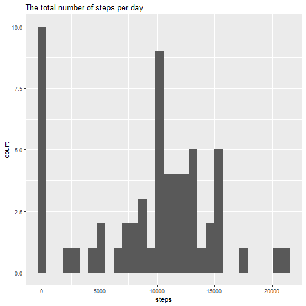
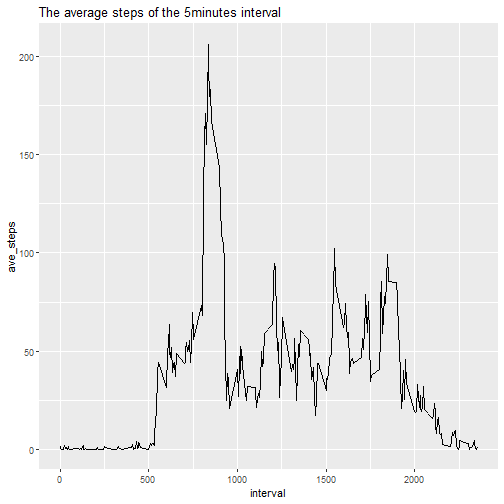
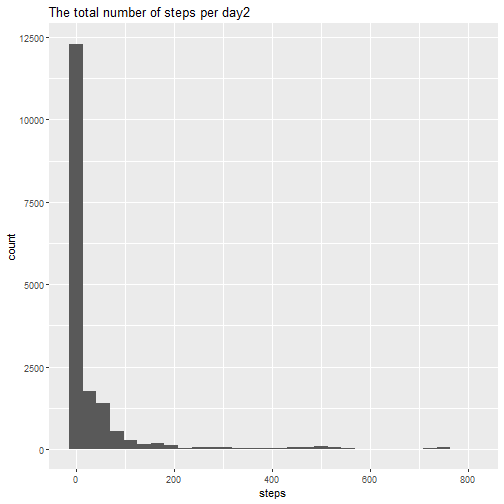
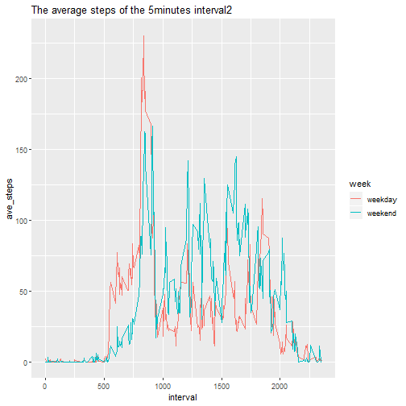

# Coursera Reproducible Research Week2 Assignment
  
## Load libraries
Load necessary packages.

```r
library(dplyr)
library(ggplot2)
```
  
## Load and clean the data
This is the data.

```r
data <- read.csv("activity.csv")
str(data)
```

```
## 'data.frame':	17568 obs. of  3 variables:
##  $ steps   : int  NA NA NA NA NA NA NA NA NA NA ...
##  $ date    : Factor w/ 61 levels "2012-10-01","2012-10-02",..: 1 1 1 1 1 1 1 1 1 1 ...
##  $ interval: int  0 5 10 15 20 25 30 35 40 45 ...
```
The data variable is a factor.
Change them into date format.

```r
data <- data %>% 
	mutate(date=as.Date(date, "%Y-%m-%d"))
```
  
## Total number of steps taken per day
Calculate the total number of steps taken per day
and make a histogram.

```r
data %>% group_by(date) %>% 
	summarise(steps = sum(steps, na.rm=TRUE)) %>%
	ggplot(aes(x=steps)) + 
	geom_histogram(bins=30) +
	labs(title="The total number of steps per day") 
```



Calculate the mean and median of the
total number of steps taken per day

```r
data %>% group_by(date) %>%
	summarise(mean_steps = mean(steps, na.rm=TRUE),
		median_steps = median(steps, na.rm=TRUE)) %>%
	summary
```

```
##       date              mean_steps       median_steps
##  Min.   :2012-10-01   Min.   : 0.1424   Min.   :0    
##  1st Qu.:2012-10-16   1st Qu.:30.6979   1st Qu.:0    
##  Median :2012-10-31   Median :37.3785   Median :0    
##  Mean   :2012-10-31   Mean   :37.3826   Mean   :0    
##  3rd Qu.:2012-11-15   3rd Qu.:46.1597   3rd Qu.:0    
##  Max.   :2012-11-30   Max.   :73.5903   Max.   :0    
##                       NA's   :8         NA's   :8
```
  
## Average daily activity pattern
Make a time series plot of the 5 minute interval
and the average number of steps taken

```r
data %>% group_by(interval) %>%
	summarise(ave_steps = mean(steps, na.rm=TRUE)) %>%
	ggplot(aes(x=interval, y=ave_steps)) +
	geom_line() +
	labs(title="The average steps of the 5minutes interval")
```



The interval 835 contains the maximum number of steps.

```r
data %>% group_by(interval) %>%
	summarise(ave_steps = mean(steps, na.rm=TRUE)) %>%
	arrange(desc(ave_steps)) %>% head
```

```
## # A tibble: 6 x 2
##   interval ave_steps
##      <int>     <dbl>
## 1      835      206.
## 2      840      196.
## 3      850      183.
## 4      845      180.
## 5      830      177.
## 6      820      171.
```
  
## Impute missing values
Calculate the total number of missing values in the dataset.
The step variable has 2303 NAs in 17568 rows.

```r
summary(data)
```

```
##      steps             date               interval     
##  Min.   :  0.00   Min.   :2012-10-01   Min.   :   0.0  
##  1st Qu.:  0.00   1st Qu.:2012-10-16   1st Qu.: 588.8  
##  Median :  0.00   Median :2012-10-31   Median :1177.5  
##  Mean   : 37.38   Mean   :2012-10-31   Mean   :1177.5  
##  3rd Qu.: 12.00   3rd Qu.:2012-11-15   3rd Qu.:1766.2  
##  Max.   :806.00   Max.   :2012-11-30   Max.   :2355.0  
##  NA's   :2304
```

```r
dim(data)
```

```
## [1] 17568     3
```
Fill in all of the missing values using the mean
for that 5-minute interval and create a new dataset.

```r
newData <- data %>% group_by(interval) %>%
	mutate(steps=ifelse(is.na(steps), 
		mean(steps, na.rm=TRUE),steps)) %>%
	ungroup
```
Make a histogram and calculate the mean and median like the
first assignment. Imputing missing data doesn't impact the
mean much but changed median of steps. 
Not the histogram is highly right skewed.

```r
newData %>% group_by(date) %>%
	ggplot(aes(x=steps)) +
	geom_histogram(bins=30) +
	labs(title="The total number of steps per day2") 
```



```r
newData %>% group_by(date) %>%
	summarise(mean_steps = mean(steps),
		median_steps = median(steps)) %>%
	summary
```

```
##       date              mean_steps       median_steps   
##  Min.   :2012-10-01   Min.   : 0.1424   Min.   : 0.000  
##  1st Qu.:2012-10-16   1st Qu.:34.0938   1st Qu.: 0.000  
##  Median :2012-10-31   Median :37.3826   Median : 0.000  
##  Mean   :2012-10-31   Mean   :37.3826   Mean   : 4.474  
##  3rd Qu.:2012-11-15   3rd Qu.:44.4826   3rd Qu.: 0.000  
##  Max.   :2012-11-30   Max.   :73.5903   Max.   :34.113
```
  
## The differences between weekdays and weekends
add a new factor variable indicating whether a given
date is a weekday or weekend day.

```r
newData <- newData %>%
	mutate(week=ifelse(weekdays(date)%in%c("Sunday","Saturday"),
			"weekend", "weekday")) %>%
	mutate(week=as.factor(week))
```

Make a panel plot containing a time series plot of the interval
and the average number ov steps taken

```r
newData %>% group_by(interval, week) %>%
	summarise(ave_steps = mean(steps)) %>%
	ggplot(aes(x=interval, y=ave_steps)) +
	geom_line(aes(color=week)) +
	labs(title="The average steps of the 5minutes interval2")
```


